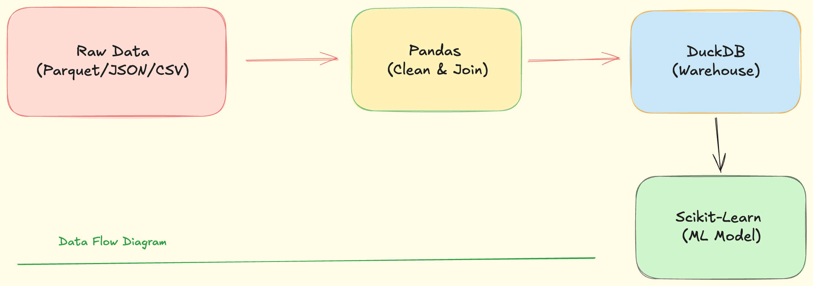

# 🚕 Lou Rides: End-to-End Fare Prediction Data Pipeline

## 📌 Pillar 1: The Business Problem

**Lou Rides** (a fictional ride-hailing company) is facing a customer trust issue. Users are being quoted an estimated upfront fare of $15, but ultimately charged $25 at the end of their ride due to unpredictable factors like weather and routing inefficiencies.

**The Objective:** The Data Science team needs to train a dynamic Machine Learning model to predict fares accurately. As a Data Engineer, my role was to build an automated **ETL (Extract, Transform, Load) Pipeline** that ingests raw historical ride logs, live weather data, and internal driver profiles, cleans the anomalies, and serves a "golden" dataset into a Data Warehouse for the ML team to consume.

---

## 🏗️ Pillar 2: Architecture & Tech Stack

This project simulates a modern data stack using local and in-memory tools for rapid prototyping.

- **Stack:**    
- **Extraction (Sources):**
  - `PyArrow`: Ingesting massive `.parquet` files (NYC TLC Taxi Data).
  - `Requests`: REST API extraction (Open-Meteo Historical Weather API).
  - `Faker`: Generating synthetic, production-like Driver databases.
- **Transformation:** `Pandas` (Data cleaning, handling anomalies, and multi-source time-series joins).
- **Load / Data Warehouse:** `DuckDB` (In-process analytical OLAP database simulating Snowflake/BigQuery).
- **Downstream Consumer:** `Scikit-Learn` (Simulating the Data Science handoff via Linear Regression).

### Data Flow Diagram



`Raw Data (Parquet/JSON/CSV)` ➔ `Pandas (Clean & Join)` ➔ `DuckDB (Warehouse)` ➔ `Scikit-Learn (ML Model)`

---

## 🗄️ Pillar 3: Data Model & Lineage

The pipeline ingests data from three highly distinct, chaotic sources and normalizes them into a single analytical table.

**1. Source Datasets (Raw):**

- **Ride Logs:** NYC Yellow Taxi Jan 2024 (Millions of rows, `.parquet`)
- **Weather Logs:** Open-Meteo API (Hourly temperature and precipitation, `.json`)
- **Driver Profiles:** Internal synthetic database (UUIDs, Ratings, Vehicle Types, `.csv`)

**2. Transformation Logic (Business Rules Applied):**

- Removed impossible trips (0 passengers, 0.0 miles).
- Filtered out negative or baseline-violating fares (< $2.50).
- Standardized `tpep_pickup_datetime` to the nearest floor hour to enable a time-series `JOIN` with the weather dataset.

**3. Final Warehouse Schema (`ds_fare_prediction_features`):**
| Column | Data Type | Description |
| :--- | :--- | :--- |
| `Driver_ID` | VARCHAR | Unique identifier for the assigned driver |
| `tpep_pickup_datetime` | TIMESTAMP | Exact time the ride began |
| `trip_distance` | FLOAT | Total miles driven |
| `passenger_count` | INT | Number of passengers |
| `temperature_2m` | FLOAT | Temperature (Celsius) at the time of pickup |
| `precipitation` | FLOAT | Rain/Snow volume (mm) at the time of pickup |
| `fare_amount` | FLOAT | The target variable (Total cost of the ride) |

---

## 🚀 Pillar 4: Setup & Execution Instructions

To reproduce this pipeline locally, follow these steps:

### 1. Clone the Repository

```bash
git clone https://github.com/praisecookie/Lou-Rides-Fare-Pipeline.git
cd Lou-Rides-Fare-Pipeline
```

## 2. Set Up the Virtual Environment

```bash
python3 -m venv venv
source venv/bin/activate
pip install pandas requests faker pyarrow duckdb scikit-learn
```

## 3. Download the Raw Parquet File

Download the [NYC TLC Yellow Taxi Parquet file](https://www.nyc.gov/site/tlc/about/tlc-trip-record-data.page) and place it directly into the root folder of this project.

## 4. Execute the Pipeline

Run the scripts sequentially to trigger the ETL process:

```bash
# 1. Extract data from Parquet, API, and Faker
python3 extract.py

# 2. Clean, filter, and join the multi-source data
python3 transform.py

# 3. Load the golden dataset into DuckDB
python3 load.py

# 4. Trigger the Data Science ML training script
python3 train_model.py
```

_(Disclaimer: This is a fictional data engineering real world problem simulation, none of the data used in this project is directly relating to an actual organations data engineering team.)_
